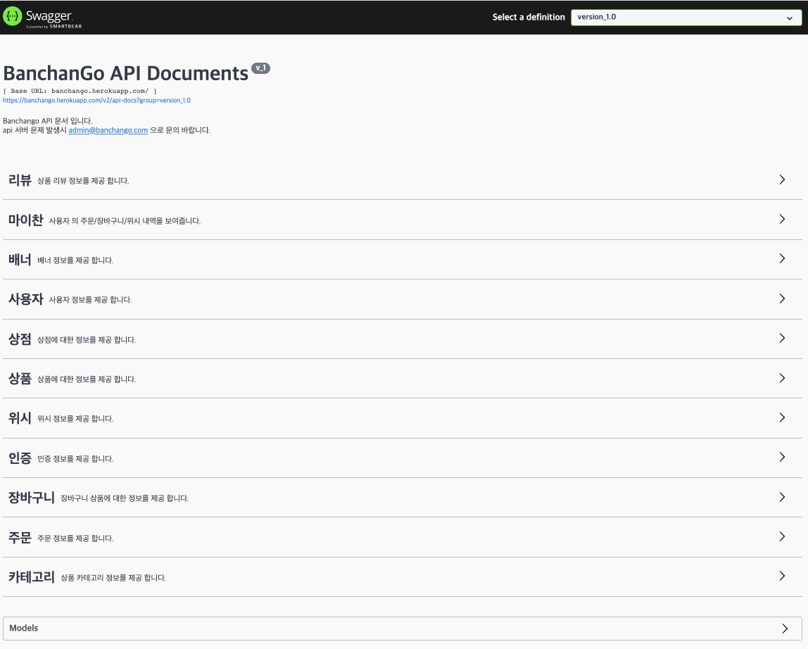
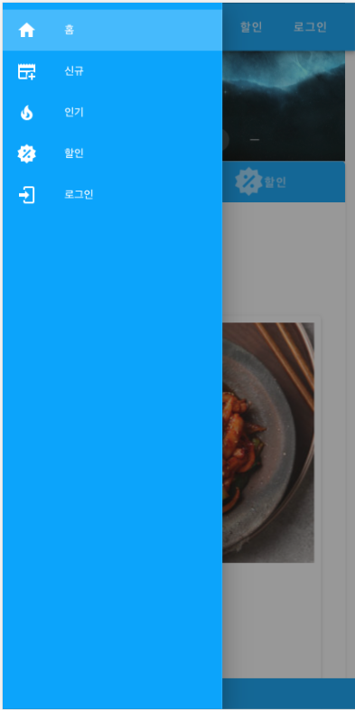
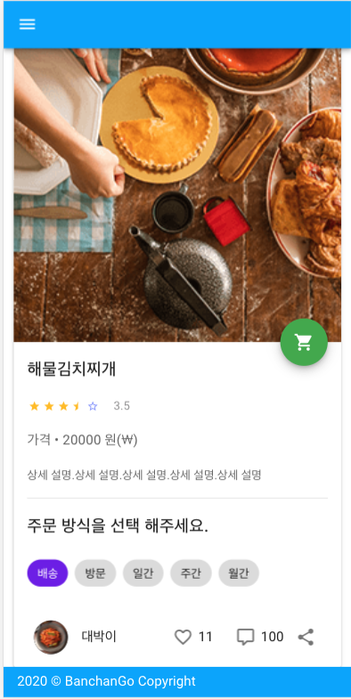
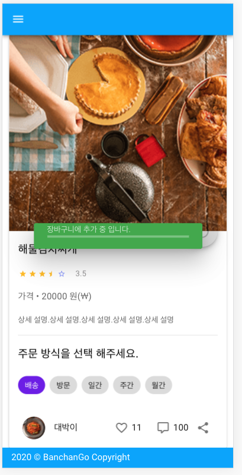

# Tutorial spring reactive and vuejs

```
Tutorial for spring boot reactive and vuejs
```

## back-end
```
- run
mvn spring-boot:run
- build
mvn package
- jar execute
java tvf target/*.jar


```
### rest api server
> [api-doc](https://banchango.herokuapp.com/api)


## front-end 
```
- package install
npm install
- execute
npm run serve
- code linting
npm run lint
```

### home


### app bar


### detail


### cart


