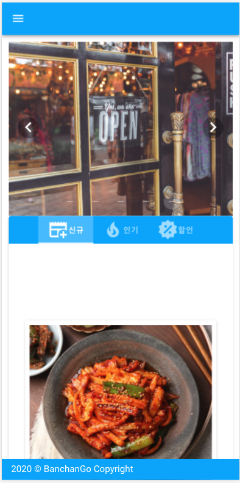
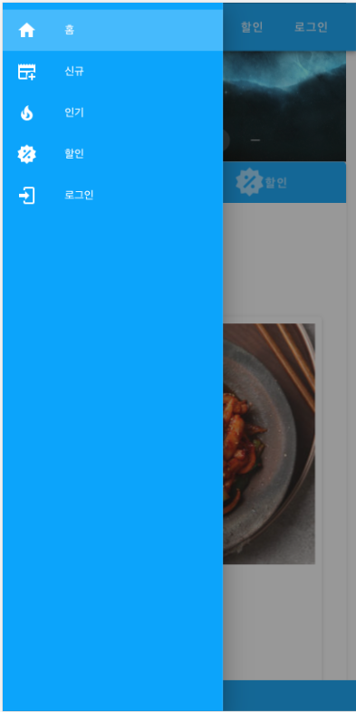
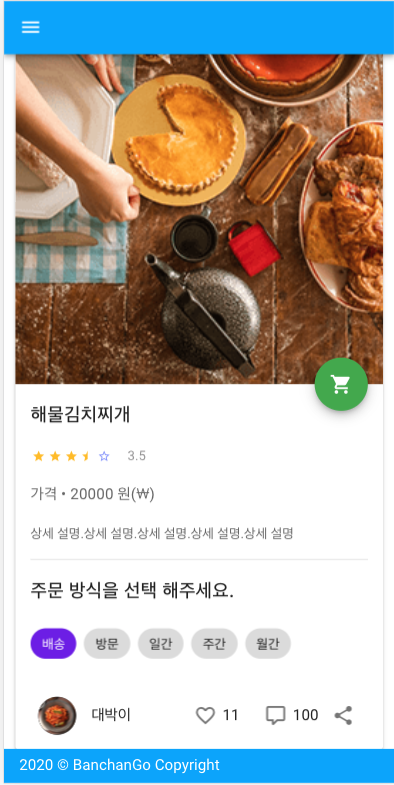
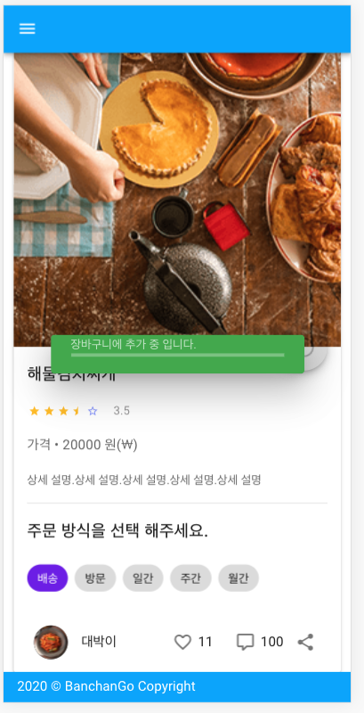

# VuetifyShop

```
tutorial for vuejs, vuetify, axios
```

## run
```
- npm install

- npm run serve

```

## rest api server
> [api-doc](https://banchango.herokuapp.com/api)

## rest api repository
> [rest-api repository](https://github.com/Gavinkim/spring-reactive-tutorial)

### home


### app bar


### detail


### cart
